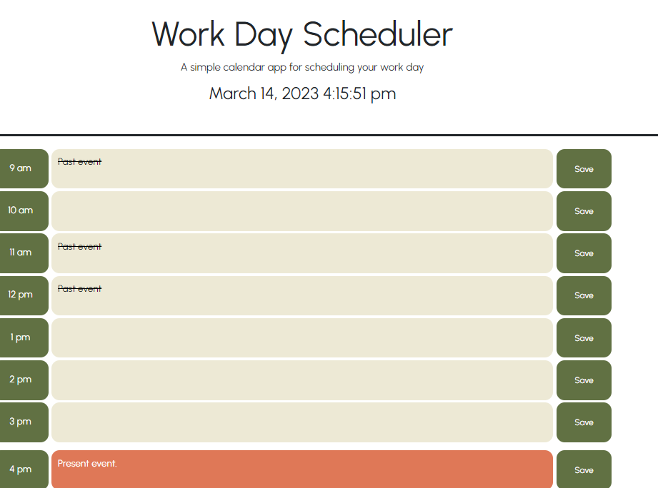
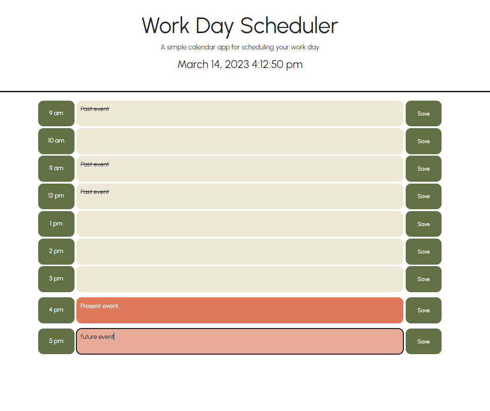
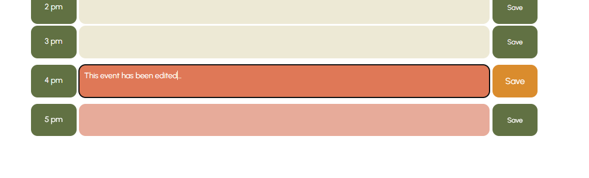

# Work Day Scheduler

## Project Description

Work Day Sceduler has been created to aid busy employees with their time management by storing importnat events organised in hour blocks.

## Links

Access the scheduler at [live page](https://voi-jankowski.github.io/work-day-scheduler/) And here you can find the code for this project: [GitHub](https://github.com/voi-jankowski/work-day-scheduler)

## Installation

N/A

## Usage

When you open the page you can see the date and time in the header. The clock is live and it updated every second.

Below you can find the hour blocks of your daily scheduler. Click on the middle cell to enter your event and click save button next to it, to store it.

When you reopen the page you can still view your saved events. You can edit your events by clicking on them and saving the changes by Save button.

## Credits

Coulor palette sourced from https://colorhunt.co/palette/ede9d5e7ab9adf7857617143

## License

Please refer to the LICENSE in the repo.